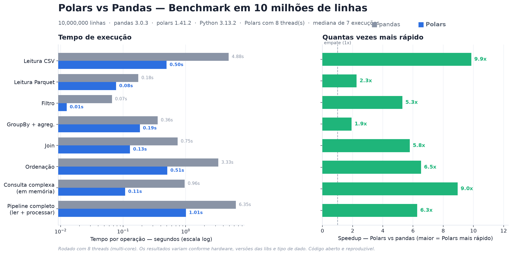

# 🐻‍❄️ Polars vs 🐼 Pandas — Benchmark Honesto

Comparação de performance entre **Polars** e **Pandas** em operações comuns de
um pipeline de dados, usando **10 milhões de linhas**. O objetivo não é "provar"
que uma biblioteca é melhor, e sim **medir com método** e entender *por que* e
*quando* cada uma vence.

> Projeto nasceu de uma conversa com o Eduardo, que me apresentou o Polars. 🙏

## 📊 Resultados

_A tabela abaixo é atualizada automaticamente pelo `grafico.py` com os números da
sua máquina. O exemplo inicial foi gerado em **1 thread** (subestima o Polars)._

<!-- RESULTADOS_INICIO -->
Rodado em **8 núcleo(s) de CPU** (Polars usando 8 thread(s)) · pandas 3.0.3 · polars 1.41.2 · Python 3.13.2 · 10,000,000 linhas · mediana de 7 execuções.

| Operação | pandas (s) | Polars (s) | Speedup |
|----------|-----------:|-----------:|--------:|
| Leitura CSV | 4.88 | 0.50 | **9.9x** |
| Leitura Parquet | 0.18 | 0.08 | **2.3x** |
| Filtro | 0.07 | 0.01 | **5.3x** |
| GroupBy + agreg. | 0.36 | 0.19 | **1.9x** |
| Join | 0.75 | 0.13 | **5.8x** |
| Ordenação | 3.33 | 0.51 | **6.5x** |
| Consulta complexa (em memória) | 0.96 | 0.11 | **9.0x** |
| Pipeline completo (ler + processar) | 6.35 | 1.01 | **6.3x** |
<!-- RESULTADOS_FIM -->



## 🔎 O que aprendi (a parte interessante)

- **Polars vence na maioria**, mas não em tudo. No `GroupBy` em 1 thread, o
  pandas 3.0 empatou/ganhou — porque o maior trunfo do Polars é o **paralelismo
  multi-core**, que some quando só há 1 thread.
- **O modo `lazy` brilha no pipeline completo.** Com `scan_csv`, o otimizador faz
  *predicate/projection pushdown*: lê só as colunas e linhas necessárias. Por isso
  o pipeline "ler do disco + processar" é onde a diferença mais aparece.
- **Cuidado com benchmark injusto:** comparar Polars lazy (que inclui a leitura)
  contra pandas operando sobre dados já em memória dá um resultado enganoso. Aqui
  separei "em memória" de "pipeline completo".

## ⚖️ Single-thread vs multi-core: o experimento mais honesto

A crítica nº 1 desse tipo de comparação é *"Polars só ganha porque usa todos os
núcleos"*. Dá pra responder isso com dado, na **mesma máquina**, rodando duas vezes:

```bash
# 1 thread (neutraliza o paralelismo)
POLARS_MAX_THREADS=1 python benchmark.py && python grafico.py
# renomeie o resultado, ex: cp benchmark_polars_pandas.png bench_1thread.png

# todos os núcleos (ex.: 8 no MacBook Air M2)
python benchmark.py && python grafico.py
# cp benchmark_polars_pandas.png bench_multicore.png
```

> As duas execuções sobrescrevem `resultados.json` / `.png`. Renomeie entre elas
> se quiser guardar os dois gráficos.

## ▶️ Como rodar (no seu Mac — M2/Apple Silicon)

```bash
# 1) entre na pasta do projeto
cd caminho/para/benchmark-polars-pandas

# 2) crie e ative um ambiente virtual (recomendado)
python3 -m venv .venv
source .venv/bin/activate

# 3) instale as dependências (todas têm wheels nativos arm64)
pip install -r requirements.txt

# 4) rode o benchmark (gera ~490 MB de dados na 1a vez) e o gráfico
python benchmark.py
python grafico.py
```

O M2 tem 8 núcleos e o Polars usa todos por padrão — espere speedups maiores
que os do exemplo em `groupby`, `join` e `sort`. O `grafico.py` atualiza a tabela
de resultados acima automaticamente. Ajuste `N_ROWS` no topo de `benchmark.py`
se quiser testar outros volumes.

## 🚀 Como publicar no GitHub

> Os comandos abaixo você roda na sua máquina (suas credenciais ficam com você).
> O `.gitignore` já exclui os ~490 MB de dados gerados, então o repo fica leve.

**Opção A — GitHub CLI (`gh`), mais rápida:**

```bash
# uma vez só: gh auth login
git init
git add .
git commit -m "Benchmark Polars vs Pandas em 10M de linhas"
gh repo create benchmark-polars-pandas --public --source=. --push
```

**Opção B — manual:**

```bash
# 1) crie um repositório VAZIO em https://github.com/new (sem README/licença)
# 2) na pasta do projeto:
git init
git add .
git commit -m "Benchmark Polars vs Pandas em 10M de linhas"
git branch -M main
git remote add origin https://github.com/SEU_USUARIO/benchmark-polars-pandas.git
git push -u origin main
```

## 🧪 Metodologia

- Mesmas operações, com **código idiomático** de cada biblioteca.
- **Warm-up** (2 execuções descartadas) + **mediana de 7 execuções** (robusta a outliers).
- Dados sintéticos com `seed` fixa (reprodutível).
- Comparação de leitura em **CSV e Parquet**, e de **eager vs lazy**.

## 📦 Estrutura

```
benchmark.py     # geração de dados + benchmark
grafico.py       # gera o gráfico e atualiza a tabela do README
resultados.json  # saída bruta da última execução
requirements.txt
.gitignore
```

---
Feito por um estudante de Ciência de Dados & IA aprendendo na prática.
Sugestões e críticas são MUITO bem-vindas. 🚀
